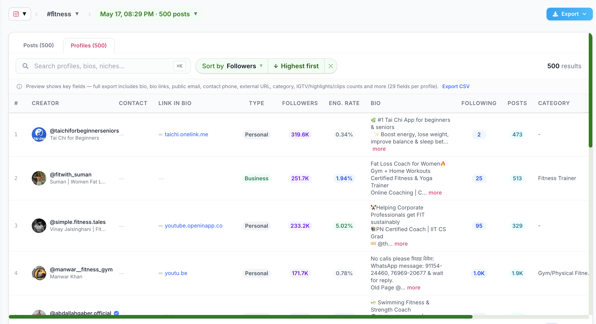
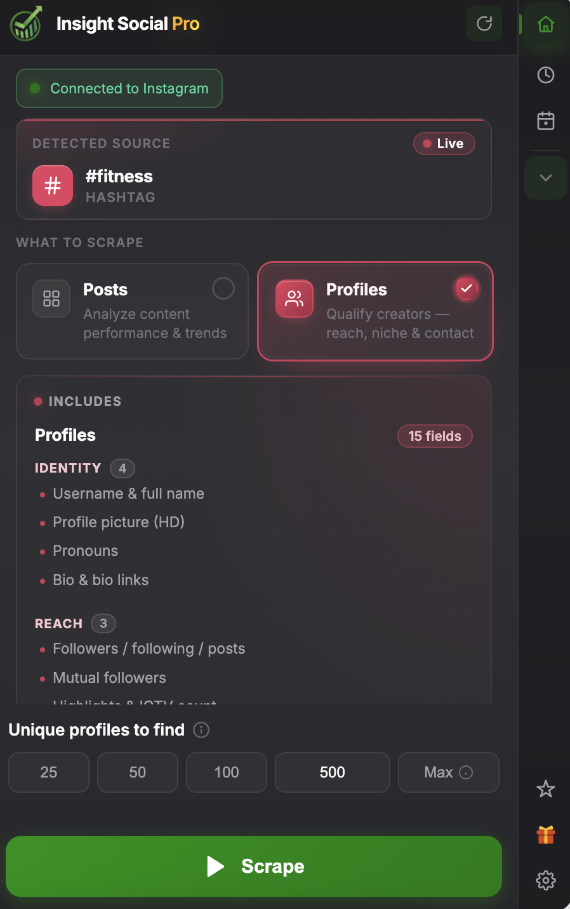
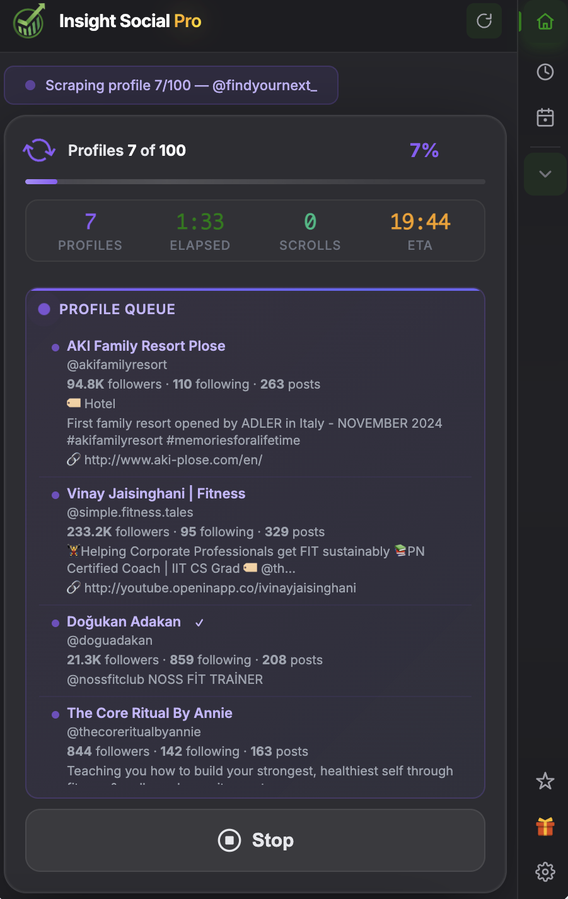
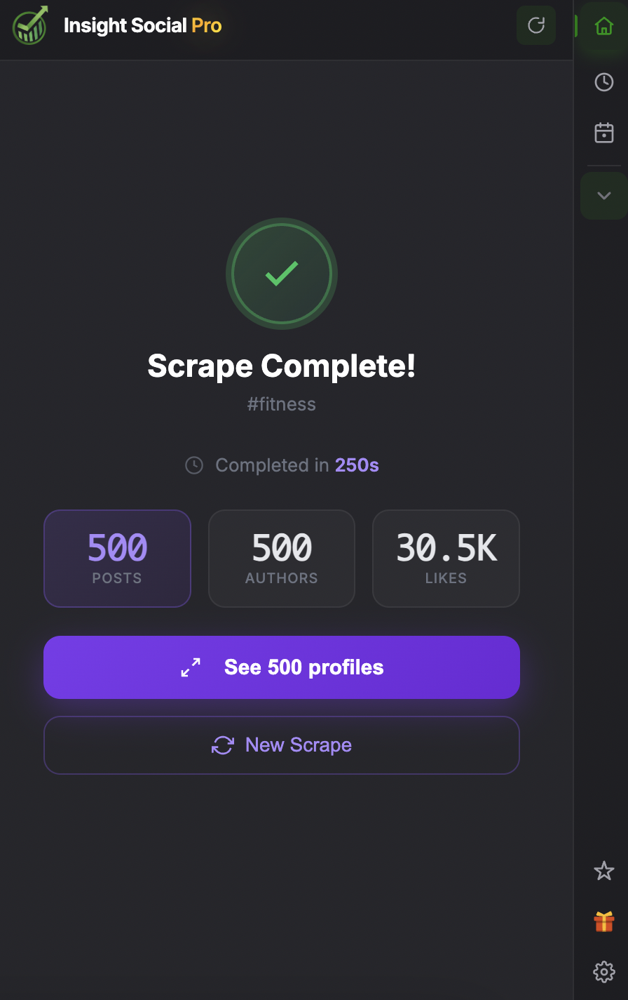

# InsightSocial — Multi-platform social media scraper

> One-click data export from Facebook, Instagram, TikTok, X (Twitter), LinkedIn, and Threads.
> Runs as a Chrome extension. No code. Free 10 runs/month.

[**Install from Chrome Web Store →**](https://chrome.google.com/webstore/detail/<id>)
&nbsp;·&nbsp; [Website](https://www.insightsocial.xyz)
&nbsp;·&nbsp; [Pricing](https://www.insightsocial.xyz/pricing)
&nbsp;·&nbsp; [Use cases](https://www.insightsocial.xyz/use-cases)
&nbsp;·&nbsp; [What's new](https://www.insightsocial.xyz/whats-new)

*Example: scraping `#fitness` on Instagram. 500 creator profiles with contact info, engagement rates, and bios — exportable to CSV in one click.*

---

## What it does

InsightSocial scrapes the social platforms you're already logged into — directly from your browser — and exports the results to CSV or JSON. Nothing leaves your machine until you choose to sync, and there's nothing to configure beyond installing the extension.

### Supported platforms & sources

| Platform | Sources |
|---|---|
| **Facebook** | Groups · Pages · Profiles · Home Feed · Single Post |
| **Instagram** | Hashtag · Profile · Followers · Home · Explore · Post |
| **TikTok** | Hashtag · Profile · Single Video · Search · For You |
| **X (Twitter)** | Home · Profile · Search |
| **LinkedIn** | Feed · Company · Profile |
| **Threads** | Feed · Profile · Single Post (comments) |

## How it works

1. **Install** the extension from the Chrome Web Store.
2. **Open** a supported page (e.g. an Instagram hashtag, a Facebook group, a TikTok profile).
3. **Click the InsightSocial side panel** and pick what to scrape. The extension scrolls + collects in the background.
4. **Export** to CSV or JSON, or view results in the [web portal](https://www.insightsocial.xyz/portal).

### See it in action

<table>
  <tr>
    <td align="center" width="33%">
       
      <b>1. Detect & configure</b> Side panel auto-detects the page type and shows what's scrapeable.
    </td>
    <td align="center" width="33%">
       
      <b>2. Scrape live</b> Real-time progress, ETA, and a queue of what's being collected.
    </td>
    <td align="center" width="33%">
       
      <b>3. Done</b> Summary stats, then jump to the full results table.
    </td>
  </tr>
</table>

## Pricing

| Plan | Runs / month | Price |
|---|---|---|
| **Free** | 10 | $0 |
| **Pro Monthly** | 300 | $4.99 / month |
| **Pro Yearly** | 3,600 upfront | $47.88 / year ($3.99 / mo) |

One "run" = one scrape session (unlimited posts inside it). [**Refer a friend**](https://www.insightsocial.xyz/referral) and you both get +10 bonus runs — they never expire.

[See full pricing →](https://www.insightsocial.xyz/pricing)

## Use cases

- **[Lead generation](https://www.insightsocial.xyz/use-cases/lead-generation)** — extract members from Facebook groups, followers from Instagram profiles, engaged audiences from LinkedIn company pages.
- **[Competitor analysis](https://www.insightsocial.xyz/use-cases/competitor-analysis)** — track what competitor accounts post, who engages, what hashtags they ride.
- **[Content research](https://www.insightsocial.xyz/use-cases/content-research)** — pull top-performing TikToks for a hashtag, viral X threads, Instagram hashtag feeds.

## FAQ

**Is this safe for my account?**
The extension runs inside your normal browser session and mimics human scrolling. There are no third-party servers between you and the platform. That said, all scraping carries some risk — use a secondary account if you're doing high volume.

**How do I export data?**
After a scrape session completes, click **Export** in the side panel. CSV and JSON are both supported, with per-platform column sets.

**Do scheduled scrapes work when my browser is closed?**
No — schedules run via Chrome alarms, which require the browser to be open. We're upfront about this; nobody else's "scheduled scraper" works closed either, they just don't tell you.

**Where is my data stored?**
Locally in your browser (IndexedDB) until you choose to sync. Synced data lives in our database under your account only.

**Is there an API?**
The web app's REST API powers our own extension and is documented at [insightsocial.xyz/docs](https://www.insightsocial.xyz/docs). It is not yet a public/programmatic API — talk to us if you need that.

## Roadmap

- More platforms (Reddit, YouTube comments) — planned
- Public API + Zapier integration — exploring
- Bulk export from saved sessions — in progress

[See the public changelog →](https://www.insightsocial.xyz/whats-new)

## Support

- Email: **insightsocial.xyz@gmail.com**
- Web portal: **https://www.insightsocial.xyz/portal**

## About

InsightSocial is built by independent makers shipping in public. Follow along:
- Twitter/X: [@insightsocial](https://x.com/insightsocial)
- Blog: [insightsocial.xyz/blog](https://www.insightsocial.xyz/blog)

---

*InsightSocial is not affiliated with Meta, ByteDance, X Corp, or Microsoft. All platform names are trademarks of their respective owners.*
